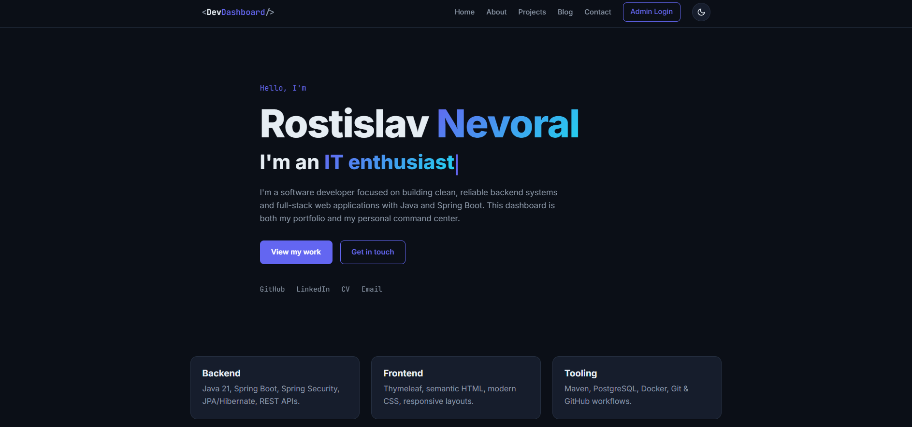
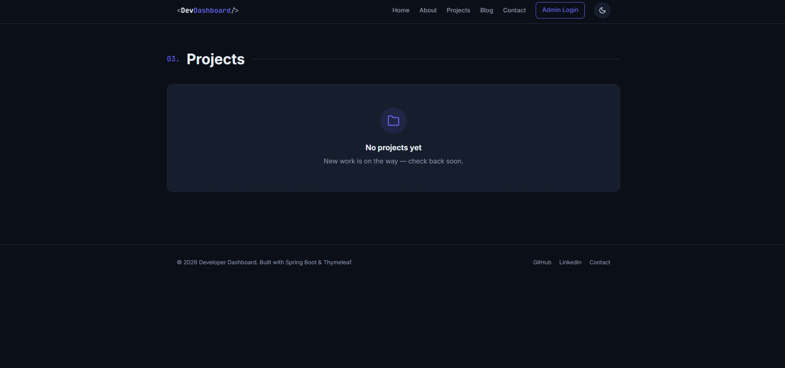
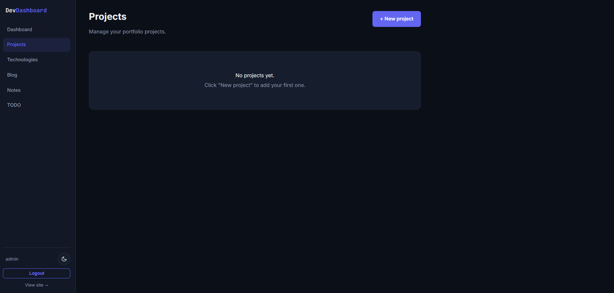
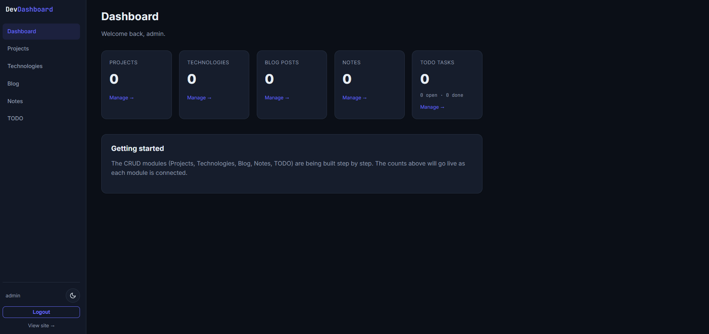
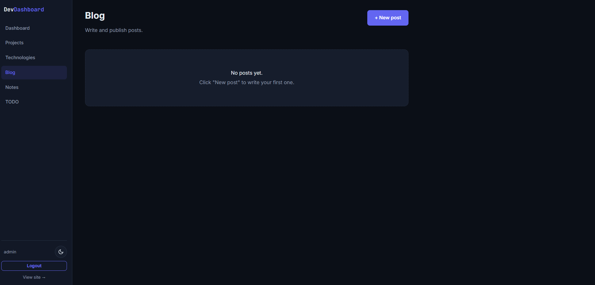
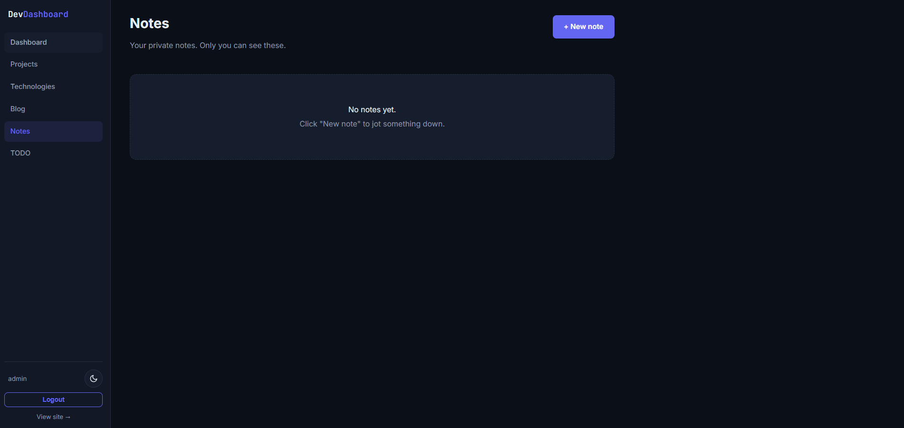

# Developer Dashboard

A full-stack **Java web application** that doubles as a personal **portfolio CMS** and a private **developer dashboard**. The public side is a clean, dark-themed developer portfolio (home, about, projects, blog, contact). The private side is a secured admin panel for managing all of that content — projects, technologies, blog posts, notes, and a TODO board — with live overview statistics.

It was built to practice production-style Spring Boot architecture end to end: package-by-feature structure, a service layer, DTO form binding, JPA relationships, Spring Security with form login, and a Dockerized PostgreSQL setup alongside a zero-config H2 dev mode.

> **Stack:** Java 21 · Spring Boot 4 · Spring MVC · Thymeleaf · Spring Security · Spring Data JPA / Hibernate · Flyway · H2 · PostgreSQL · Docker · Maven · HTML/CSS

---

## Table of contents

- [Features](#features)
- [Screenshots](#screenshots)
- [Tech stack](#tech-stack)
- [Architecture](#architecture)
- [Running locally](#running-locally)
- [Production deployment](#production-deployment)
- [Project structure](#project-structure)
- [What I learned](#what-i-learned)
- [Future improvements](#future-improvements)
- [License](#license)

---

## Features

**Public portfolio**
- Modern, responsive UI with a **dark / light mode** toggle (remembers your choice, follows the system preference by default)
- Animated **landing page** — entrance animations, an interactive typewriter hero, and subtle on-scroll reveals (all respecting `prefers-reduced-motion`)
- Home / hero page with intro and social links
- About page with bio and skills
- Projects list + project detail pages (loaded from the database)
- Blog list + post detail pages (only published posts are visible)
- Contact page
- Custom dark-themed **error page** (404 / 403 / 500)

**Admin dashboard** (secured area)
- Form-based authentication with BCrypt-hashed passwords
- **Dashboard statistics** — live counts for projects, technologies, blog posts, notes and tasks (with open/done split)
- **Project management** — title, slug, short/long description, GitHub & live-demo URLs, image, featured flag
- **Technology management** — name + optional color, with safe delete (blocked while in use)
- **Many-to-many Project ↔ Technology** — pick technologies per project; rendered as colored chips
- **Blog** with **draft / published** workflow
- **Notes** — private working notes
- **TODO board** — tasks with **status** (To do / In progress / Done) and **priority** (Low / Medium / High), optional deadline, and one-click status changes

**Engineering**
- Package-by-feature architecture with controller → service → repository layering
- Validated **DTO form objects** (the browser never binds straight onto JPA entities)
- SEO-friendly **slugs** with automatic uniqueness handling
- **H2 in-memory** dev mode (zero setup) and a **PostgreSQL** profile for Docker / production

---

## Screenshots

### Home page



### Projects page



### Project detail



### Admin dashboard



### Admin blog



### Admin TODO


### Admin notes



---

## Tech stack

| Layer | Technology |
|------|------------|
| Language | Java 21 |
| Framework | Spring Boot 4 (Spring MVC) |
| View | Thymeleaf + reusable fragments, custom CSS (dark/light themes), vanilla JS |
| Security | Spring Security (form login, BCrypt) |
| Persistence | Spring Data JPA / Hibernate |
| Migrations | Flyway (versioned SQL) |
| Database (dev) | H2 (in-memory) |
| Database (prod) | PostgreSQL 17 |
| Monitoring | Spring Boot Actuator (health) |
| Build | Maven (wrapper included) |
| Infra | Docker / Docker Compose |
| Boilerplate | Lombok |

---

## Architecture

- **Controller → Service → Repository.** Controllers never touch repositories directly; all business rules live in the service layer.
- **DTO form binding.** Each module has a `*Form` class with Jakarta Validation annotations; the service maps it to/from the entity. This keeps `id`, `slug` and timestamps out of reach of the browser.
- **Post/Redirect/Get.** Every create/update/delete redirects with a flash message, so refreshing never re-submits a form.
- **Profiles.** An in-memory H2 profile for frictionless local development and a PostgreSQL profile for Docker and production — the same code, no changes.
- **Versioned schema.** In production the PostgreSQL schema is owned by **Flyway** migrations; Hibernate runs in `validate` mode and refuses to start if the entities and the migrated schema drift apart.
- **Configuration via environment.** All credentials and connection settings are read from environment variables; nothing sensitive is committed to the repository.

---

## Running locally

**Prerequisites:** JDK 21+. (Docker only needed for PostgreSQL mode — the Maven wrapper `mvnw` is included, so no local Maven install is required.)

### H2 (default, zero setup)

The app runs out of the box on an in-memory H2 database. Nothing to install.

```powershell
cd developer-dashboard
.\mvnw.cmd spring-boot:run
```

App: <http://localhost:8080>

> H2 is in-memory, so data resets on every restart. On Linux/macOS use `./mvnw` instead of `.\mvnw.cmd`.

### PostgreSQL via Docker

Runs against a real PostgreSQL container; data persists across restarts.

```powershell
cd developer-dashboard

# 1) Start PostgreSQL and wait until it is healthy
docker compose up -d --wait

# 2) Run the app with the "postgres" profile
$env:SPRING_PROFILES_ACTIVE = "postgres"
.\mvnw.cmd spring-boot:run
```

Configuration is read from environment variables. Copy `.env.example` to `.env` (git-ignored, auto-read by Docker Compose) and adjust as needed; the same variable names are honored by the Spring `postgres` profile.

When you're done:

```powershell
docker compose stop      # stop the DB, keep data (named volume)
# docker compose down -v # remove the container AND the data (full reset)
```

---

## Production deployment

The application is container-ready and designed to run behind a reverse proxy on a VPS or any container host.

```bash
# 1) Configure the environment (never commit the real file)
cp .env.example .env
#   set strong values for POSTGRES_PASSWORD, ADMIN_USERNAME and ADMIN_PASSWORD

# 2) Build and start the full stack (app + database)
docker compose --profile app up -d --build
```

Notes for a real deployment:

- **All secrets come from the environment** (`.env` or your platform's secret manager) — there are no credentials baked into the image or the repository.
- The **first administrator account** is created on first startup only, and only when admin credentials are supplied. If none are provided, no account is created — there is no built-in default account in production.
- The **H2 console is disabled** outside of local H2 development, and the corresponding security relaxations do not apply in the PostgreSQL profile.
- **Error responses don't expose** stack traces, messages, or exception types.
- The login form is **throttled** — repeated failed attempts temporarily lock out the offending client.
- **Health checks** are exposed at `/actuator/health` (status only, no internal details) and used by the container healthcheck.
- The schema is managed by **Flyway** migrations (`src/main/resources/db/migration`); review and add a new versioned script for any schema change.
- Put a **reverse proxy (e.g. Nginx) with HTTPS** (Let's Encrypt) in front of the app and terminate TLS there.
- Back up the PostgreSQL volume regularly.

---

## Project structure

Package-by-feature: each feature owns its entity, repository, service, controller(s) and form DTO, so related code lives together rather than being split across giant `controllers/` / `services/` packages.

```
src/main/java/io/github/tewyss/developer_dashboard/
├── DeveloperDashboardApplication.java
├── common/        # Shared helpers: SlugUtil, ResourceNotFoundException (HTTP 404)
├── config/        # Startup configuration
├── security/      # Spring Security configuration & authentication
├── user/          # User entity + repository
├── home/          # Public pages: home, about, contact
├── dashboard/     # Admin overview statistics
├── project/       # Project module (entity, repo, service, controllers, form)
├── technology/    # Technology module (M:N with Project)
├── blog/          # Blog module (draft/published)
├── note/          # Notes module
└── todo/          # TODO module (status + priority enums)

src/main/resources/
├── templates/     # Thymeleaf views + reusable fragments
├── static/css/    # main.css (dark/light theme tokens for public + admin)
├── static/js/     # theme toggle + landing-page effects (vanilla JS)
├── db/migration/  # Flyway versioned SQL migrations (PostgreSQL)
├── application.properties            # default profile (H2)
└── application-postgres.properties   # "postgres" profile

Dockerfile           # multi-stage build of the application image
docker-compose.yml   # PostgreSQL service (+ optional app service)
.env.example         # template for environment configuration
```

---

## What I learned

- **Spring Security** — form login with a custom login page, BCrypt password hashing, a DB-backed `UserDetailsService`, securing a private area while keeping public pages open, and applying console/dev relaxations conditionally so they never reach production.
- **Thymeleaf layouts & fragments** — reusable `head` / `navbar` / `footer` fragments, parameterized fragments, and auth-aware navigation.
- **JPA relationships** — a unidirectional many-to-many with a single owning side and a join table, plus `@EntityGraph` to avoid lazy-loading errors and N+1 queries.
- **DTO form binding & validation** — why you don't bind a browser form straight onto a JPA entity, and how `@Valid` + `BindingResult` drive inline field errors.
- **Enum persistence** — storing enums as `STRING` (not `ORDINAL`) so reordering constants never corrupts existing rows.
- **Dockerized PostgreSQL** — a Compose service with a healthcheck, named volumes for persistence, and a multi-stage image build for the app.
- **Profiles & configuration** — switching databases with zero code changes and reading all sensitive configuration from environment variables.
- **Production hardening** — no default credentials, environment-only secrets, disabled dev tooling, sanitized error responses, and a throttled login form.
- **Database migrations** — Flyway-versioned schema with Hibernate `validate` as a drift safety net, instead of letting Hibernate auto-generate the production schema.
- **Operability** — a Spring Boot Actuator health endpoint wired into the container healthcheck.

---

## Future improvements

- **Markdown editor** for blog posts
- **File / image uploads** for project and blog images
- **GitHub API integration** — auto-pull repositories, stars and languages
- **Responsive / mobile polish** across all pages
- **Kanban-style TODO board** (To-do / In-progress / Done columns)

---

## License

Released under the [MIT License](LICENSE). Free to use as a learning reference.
